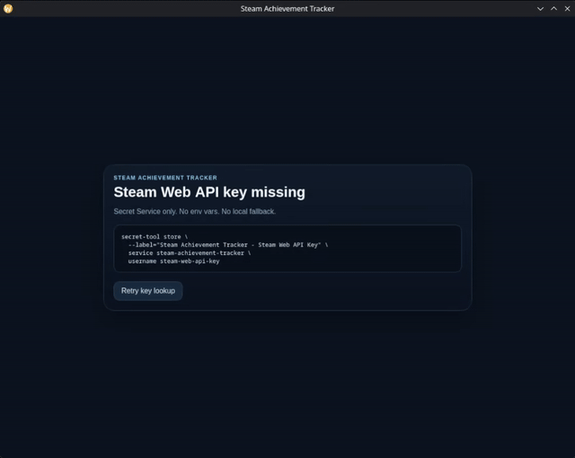
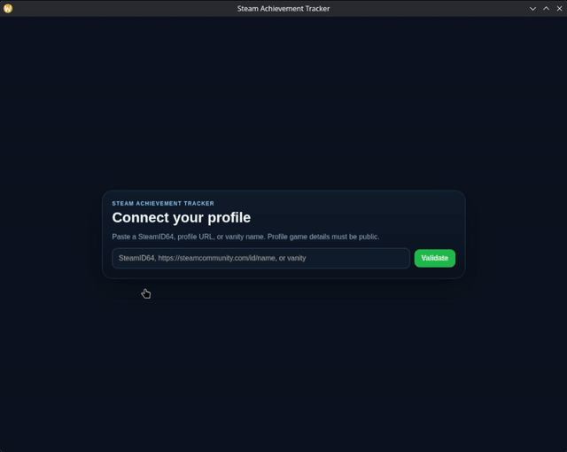
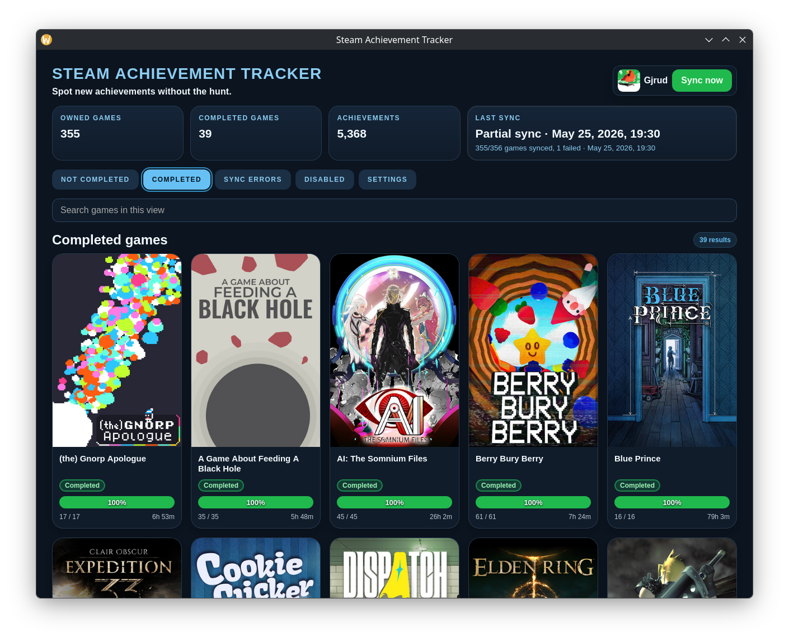
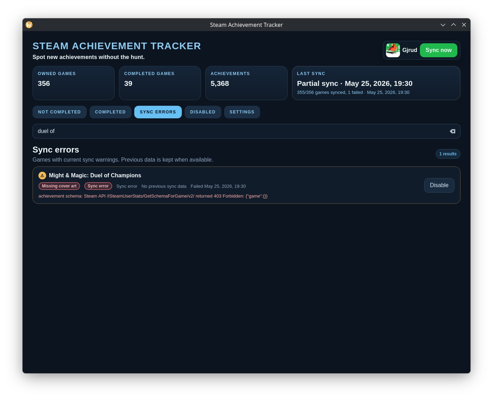
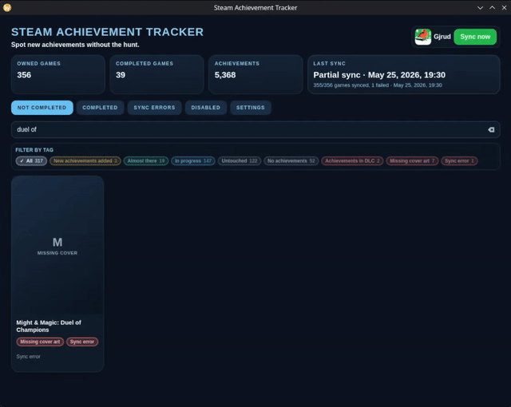
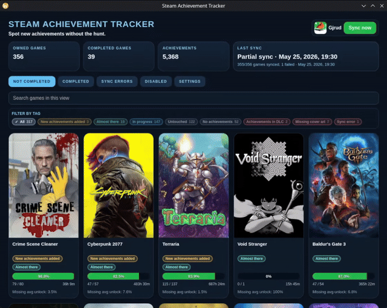
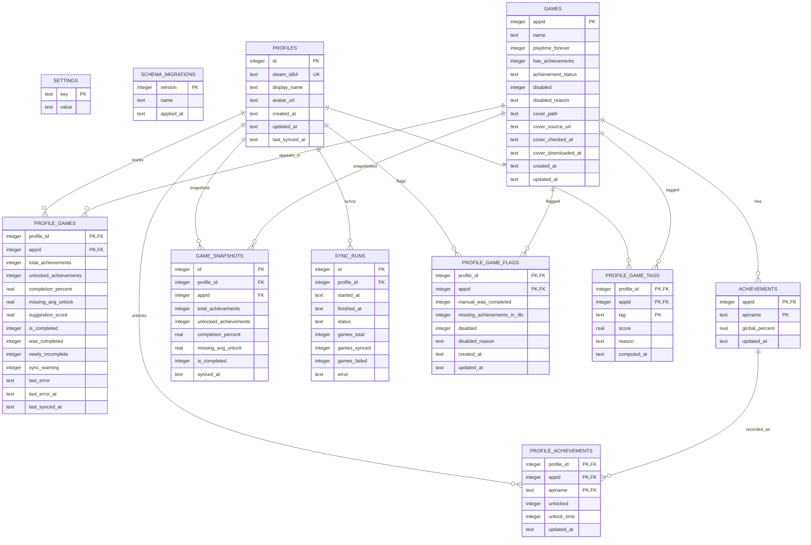

# Steam Achievement Tracker

[](LICENSE)
[](https://goreportcard.com/report/github.com/gjrud/steam-achievement-tracker)
[](go.mod)

Steam Achievement Tracker is a Linux desktop app for tracking Steam achievement completion from real Steam data. It syncs a public Steam profile, stores progress locally, highlights games worth finishing next, and keeps sync warnings visible instead of silently losing old data.

This app was born for personal use and was entirely vibecoded. I have entry-level knowledge of Go, which I often usen for personal or work related cli tools, but the Svelte/JavaScript frontend is far outside my own area of expertise.

## Features

- **Steam profile setup** from SteamID64, `steamcommunity.com/profiles/...` URLs, `steamcommunity.com/id/...` URLs, or vanity names.
- **Secret Service-only API key storage** for the Steam Web API key; no environment variable or plaintext fallback is used.
- **Startup and manual sync** against Steam Web API data.
- **Dashboard summary** for owned games, completed games, unlocked achievements, and latest sync status.
- **Not completed view** with ranked suggestions, search, and tag filters.
- **Completed games view** for games with full achievement completion.
- **Sync errors view** for games that failed refresh while preserving prior local data.
- **Disabled games view** for manually disabled games or games no longer owned by the active profile.
- **Per-game actions** to mark a game as previously completed, flag missing achievements as DLC-related, disable a game, or re-enable it.
- **Local cover cache** using Steam library capsule images.
- **Profile-scoped data clear** that removes the active profile, tracked games, achievements, sync history, manual flags, and cached covers while keeping the Secret Service key and logs.
- **Local SQLite storage** with migration backups, WAL mode, and app-local log rotation.

## Requirements

### Compiled version

- Linux desktop session.
- GTK/WebKit runtime libraries compatible with the build. This project uses Wails with the `webkit2_41` build tag, so release builds target GTK3 + WebKit2GTK 4.1 + libsoup 3 runtime libraries.
- Linux Secret Service provider, such as GNOME Keyring or another compatible keyring service.
- `secret-tool` from libsecret tools to store the Steam Web API key.
- Steam Web API key.
- Network access to Steam Web API and Steam static asset hosts.
- Public Steam profile game details for the profile being tracked.

Package names differ by distribution. On Debian/Ubuntu-style systems, look for packages similar to `libgtk-3-0`, `libwebkit2gtk-4.1-0`, `libsoup-3.0-0`, `gnome-keyring`, and `libsecret-tools`.

### Development version

- Go 1.26.2 or newer.
- Node.js frontend tooling required by Wails.
- Wails v2 CLI. Example:

  ```sh
  go install github.com/wailsapp/wails/v2/cmd/wails@v2.12.0
  ```

- Linux build dependencies for Wails and CGO: C compiler, `pkg-config`, GTK3 development headers, WebKit2GTK 4.1 development headers, and libsoup 3 development headers.
- SQLite CGO support through `github.com/mattn/go-sqlite3` dependencies, normally covered by the compiler and system SQLite/CGO toolchain.
- Same Secret Service, Steam Web API key, network, and public profile requirements as the compiled version for real sync testing.

Use `wails doctor` to check local Wails dependencies.

## Install

### 1. Install runtime dependencies

Install GTK/WebKit runtime libraries, a Secret Service provider, and `secret-tool` for your distribution.

### 2. Install the app binary

Download the release artifact for Linux, then place the executable somewhere on your `PATH`, for example:

```sh
mkdir -p ~/.local/bin
cp steam-achievement-tracker ~/.local/bin/steam-achievement-tracker
chmod +x ~/.local/bin/steam-achievement-tracker
```

If you build from source, the production binary is created at `build/bin/steam-achievement-tracker`.

### 3. Store the Steam Web API key

Store the key in Secret Service:

Generate a Steam Web API key from Steam's developer page: <https://steamcommunity.com/dev/apikey>.

```sh
secret-tool store \
  --label="Steam Achievement Tracker - Steam Web API Key" \
  service steam-achievement-tracker \
  username steam-web-api-key
```

Paste the Steam Web API key when prompted by `secret-tool`. The app reads only this Secret Service item.

### 4. Launch

```sh
steam-achievement-tracker
```

If the API key is missing, the app opens to the key setup screen and shows the same `secret-tool` command.

## Build & run

Wails handles frontend dependency installation and frontend builds through the hooks in `wails.json`.

Run the desktop app in development mode from the repository root:

```sh
wails dev
```

Build the production app from the repository root:

```sh
wails build
```

The production binary is written to:

```text
build/bin/steam-achievement-tracker
```

## Testing

Run frontend tests:

```sh
cd frontend
npm test
```

Run backend tests from a clean tree by building the frontend first, because `main.go` embeds `frontend/dist`:

```sh
cd frontend
npm run build
cd ..
go test ./...
```

Run both:

```sh
cd frontend && npm test && npm run build
cd ..
go test ./...
```

## Usage

### Set up the API key

Before sync can run, store a Steam Web API key in Secret Service using the command in [Install](#3-store-the-steam-web-api-key). If the key is missing, the app shows the setup command and a **Retry key lookup** button. Store the key, then click **Retry key lookup**.



### Connect a Steam profile

On first launch with a valid API key and no active profile, enter one of:

- SteamID64, such as `7656119...`
- Profile URL, such as `https://steamcommunity.com/profiles/<steamid64>`
- Vanity URL, such as `https://steamcommunity.com/id/<name>`
- Vanity name by itself

Click **Validate**. The app resolves the profile and shows the Steam display name/avatar. Click **Save and sync** to save it as the active profile and start a background sync. Profile game details must be public.



### Sync achievements

Sync starts after saving a profile and again on app startup when a profile and API key exist. Use **Sync now** to start a manual refresh; the button changes to **Syncing…** while a sync is running.

Sync behavior:

- Owned games, names, playtime, achievements, and cover images are loaded from Steam.
- Games no longer returned by Steam for the active profile are disabled for that profile.
- Disabled games are skipped, including manually disabled games and games disabled because Steam no longer reports them as owned.
- Per-game sync runs with concurrency limit `4`.
- Steam API requests retry transient `429`, `500`, and `503` responses.
- Failed per-game refreshes keep prior local data when available and appear in **Sync errors**.
- If any per-game refresh fails, the sync run is marked `partial`.

### Read the dashboard

The top summary shows:

- active owned games count, excluding disabled games
- completed games count, excluding disabled games
- unlocked achievement count, excluding disabled games
- current or latest sync status and per-game progress

The main tabs are **Not completed**, **Completed**, **Sync errors**, **Disabled**, and **Settings**.

### Use the Not completed view

This view lists non-disabled games that are not currently complete. Cards show cover art when cached, completion progress, playtime, tags, and the average unlock rate of missing achievements when Steam provides it.


Suggestion tags include **New achievements added**, **Almost there**, **In progress**, **Untouched**, **No achievements**, **Achievements in DLC**, **Missing cover art**, and **Sync error**. Use the search box to filter by title and the tag chips to filter the **Not completed** list.

#### Tags and sorting

The **Not completed** list is sorted to surface likely finishable games first:

1. games with achievements that are not flagged as DLC-related, with **New achievements added** games first
2. games flagged **Achievements in DLC**
3. games with no Steam achievements, sorted by title

Within active achievement games, the app sorts by suggestion score, highest first. Suggestion score is based on completion percentage and, when Steam global achievement percentages are available, the average unlock rate of the achievements you are missing. Games with a score of `40` or higher get the **Almost there** tag; other started games get **In progress**.

Tag meanings:

- **New achievements added**: the game was previously completed, but now has locked achievements.
- **Almost there**: the suggestion score is at least `40`.
- **In progress**: the game has progress, but its suggestion score is below the **Almost there** threshold.
- **Untouched**: the game has no recorded playtime.
- **No achievements**: Steam reports no achievements for the game.
- **Achievements in DLC**: remaining achievements are manually flagged as DLC-related.
- **Missing cover art**: no cover image is cached locally.
- **Sync error**: the latest per-game refresh failed.

### Review completed games

The **Completed** tab lists non-disabled games where all known achievements are unlocked. Use search to filter by title. Right-click a card to change local flags or disable the game.



### Handle sync errors

The **Sync errors** tab lists non-disabled games with current per-game sync warnings. Previous successful data is shown when available; otherwise the row says there is no previous sync data. Use the **Disable** button to hide a noisy game, or right-click the row to mark it previously completed, flag DLC-missing achievements, or disable it.



### Disable or re-enable games

Right-click a game card in **Not completed** or **Completed**, or a row in **Sync errors**, to open the game action menu. **Disable game** hides it from active game views and summary totals, and skips it in later syncs. Use the **Disabled** tab to review disabled games and click **Re-enable**.



### Manually flag games

In **Not completed**, right-click a game card and use:

- **Mark as previously completed** when a game was complete before Steam added more achievements. This adds the **New achievements added** tag while the game is incomplete.
- **Flag missing achievements in DLC** when remaining achievements belong to DLC or content you do not plan to count. This adds the **Achievements in DLC** tag.

These flags are mainly for incomplete games that need local context. They are profile-scoped, stored locally, and can be cleared from the same right-click menu. The same actions are also available from **Completed** cards and **Sync errors** rows when needed.



### Clear active user data

Open **Settings** and click **Clear data**. The app asks you to type the shown profile identifier before clearing. This removes the active profile, tracked games, achievement data, sync history, manual flags, profile-scoped tags, and cached covers for that profile. It does not remove the Secret Service API key or logs.


## Data

All app-owned files live under `~/.steam-achievement-tracker` unless noted. Directories are created with mode `0700`; local DB, backup, image, and log files are kept at `0600` where the app controls permissions.

### Stored Files

| Path | Created by (process/major function) | Purpose |
| --- | --- | --- |
| `~/.steam-achievement-tracker/` | Startup initialization | App data root. |
| `~/.steam-achievement-tracker/steam-achievement-tracker.db` | DB open/migration | SQLite database for profiles, games, achievements, flags, tags, snapshots, and sync history. |
| `~/.steam-achievement-tracker/steam-achievement-tracker.db-wal` | SQLite WAL mode | SQLite write-ahead log while database is active. |
| `~/.steam-achievement-tracker/steam-achievement-tracker.db-shm` | SQLite WAL mode | SQLite shared-memory file while database is active. |
| `~/.steam-achievement-tracker/backups/` | DB migration | Backup directory. |
| `~/.steam-achievement-tracker/backups/steam-achievement-tracker-<unix-ns>.db` | DB migration before schema changes | Point-in-time SQLite DB backup created before migrating an existing user DB. |
| `~/.steam-achievement-tracker/cache/` | Startup initialization | Cache root. |
| `~/.steam-achievement-tracker/cache/images/games/` | Startup initialization / cover cache | Game cover cache root. |
| `~/.steam-achievement-tracker/cache/images/games/<appid>/library_600x900.jpg` | Cover sync | Cached Steam library capsule image for one app. |
| `~/.steam-achievement-tracker/logs/` | Logging initialization | Log directory. |
| `~/.steam-achievement-tracker/logs/app.log` | Logging initialization | Current application log. |
| `~/.steam-achievement-tracker/logs/app.log*` | Log rotation | Rotated logs; max size is 5 MB with up to 5 backups. |
| Secret Service item `service=steam-achievement-tracker`, `username=steam-web-api-key` | User via `secret-tool` | Steam Web API key. Stored outside the app data directory by the desktop keyring. |

### steam-achievement-tracker.db Schema

| Table | Columns | Notes |
| --- | --- | --- |
| `settings` | `key` PK, `value` | App settings. Currently stores `active_profile_id`. |
| `schema_migrations` | `version` PK, `name`, `applied_at` | Applied DB migrations. Current schema version is `8`. |
| `profiles` | `id` PK, `steam_id64` unique, `display_name`, `avatar_url`, `created_at`, `updated_at`, `last_synced_at` | Steam profiles known to the app. |
| `games` | `appid` PK, `name`, `playtime_forever`, `has_achievements`, `achievement_status`, `disabled`, `disabled_reason`, `cover_path`, `cover_source_url`, `cover_checked_at`, `cover_downloaded_at`, `created_at`, `updated_at` | Shared Steam app metadata and cover cache metadata. `disabled`/`disabled_reason` are legacy/global fields; current manual disables are profile-scoped. |
| `profile_games` | `profile_id`, `appid`, `total_achievements`, `unlocked_achievements`, `completion_percent`, `missing_avg_unlock`, `suggestion_score`, `is_completed`, `was_completed`, `newly_incomplete`, `sync_warning`, `last_error`, `last_error_at`, `last_synced_at`; PK (`profile_id`, `appid`) | Per-profile game progress and latest warning state. |
| `achievements` | `appid`, `apiname`, `global_percent`, `updated_at`; PK (`appid`, `apiname`) | Per-game achievement catalog with global unlock percentage. |
| `profile_achievements` | `profile_id`, `appid`, `apiname`, `unlocked`, `unlock_time`, `updated_at`; PK (`profile_id`, `appid`, `apiname`) | Per-profile achievement unlock state. |
| `game_snapshots` | `id` PK, `profile_id`, `appid`, `total_achievements`, `unlocked_achievements`, `completion_percent`, `missing_avg_unlock`, `is_completed`, `synced_at` | Historical per-sync progress snapshots. |
| `sync_runs` | `id` PK, `profile_id`, `started_at`, `finished_at`, `status`, `games_total`, `games_synced`, `games_failed`, `error` | Sync run history and progress. Status values include `running`, `success`, `partial`, and `failed`. |
| `profile_game_flags` | `profile_id`, `appid`, `manual_was_completed`, `missing_achievements_in_dlc`, `disabled`, `disabled_reason`, `created_at`, `updated_at`; PK (`profile_id`, `appid`) | Manual, profile-scoped game flags. Indexed by (`profile_id`, `disabled`). |
| `profile_game_tags` | `profile_id`, `appid`, `tag`, `score`, `reason`, `computed_at`; PK (`profile_id`, `appid`, `tag`) | Computed profile-scoped tags used by suggestion filters. Indexed by (`profile_id`, `tag`). |



### Data sources

| URL/API/source | Description |
| --- | --- |
| `https://api.steampowered.com/ISteamUser/ResolveVanityURL/v1/` | Resolves Steam vanity names and `/id/<name>` profile URLs to SteamID64. Requires the API key. |
| `https://api.steampowered.com/ISteamUser/GetPlayerSummaries/v2/` | Loads profile display name and avatar URL for setup/confirmation. Requires the API key. |
| `https://api.steampowered.com/IPlayerService/GetOwnedGames/v0001/` | Loads the public owned game list, app names, and playtime for the active profile. Requires the API key and public game details. |
| `https://api.steampowered.com/ISteamUserStats/GetSchemaForGame/v2/` | Loads each game's achievement schema. Requires the API key. |
| `https://api.steampowered.com/ISteamUserStats/GetPlayerAchievements/v1/` | Loads per-profile unlocked achievements and unlock times for a game. Requires the API key and accessible profile/game stats. |
| `https://api.steampowered.com/ISteamUserStats/GetGlobalAchievementPercentagesForApp/v0002/` | Loads global achievement unlock percentages used for rarity/missing-average calculations. |
| `https://api.steampowered.com/IStoreBrowseService/GetItems/v1/` | Loads Steam store item assets, including library capsule source paths for cover art. |
| `https://shared.akamai.steamstatic.com/store_item_assets/...` | Primary Steam static asset host for cached game cover downloads. |
| `https://shared.steamstatic.com/store_item_assets/...` | Fallback Steam static asset host for cached game cover downloads. |
| Steam avatar URLs returned by `GetPlayerSummaries` | Displayed in the app for the active profile; URL is stored in `profiles.avatar_url`. |

The app does not send data to any non-Steam service. Steam requests include the Steam Web API key where required by Steam endpoints.
