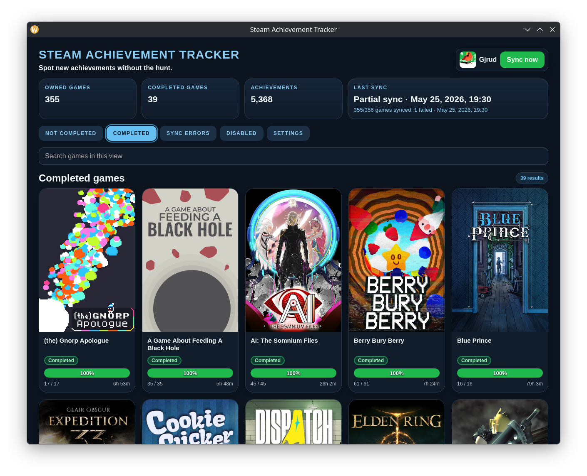

# Steam Achievement Tracker

[](LICENSE)
[](https://goreportcard.com/report/github.com/gjrud/steam-achievement-tracker)
[](go.mod)

Steam Achievement Tracker is a Linux desktop app for tracking Steam achievement completion from real Steam data. It syncs a public Steam profile, stores progress locally, highlights games worth finishing next, and keeps sync warnings visible instead of silently losing old data.

This app was born for personal use and was entirely vibecoded. I have entry-level knowledge of Go, which I often use for personal or work related cli tools, but the Svelte/JavaScript frontend is far outside my own area of expertise.

## Features

- **Steam profile setup** from SteamID64, `steamcommunity.com/profiles/...` URLs, `steamcommunity.com/id/...` URLs, or vanity names.
- **Secret Service-only API key storage** for the Steam Web API key; no environment variable or plaintext fallback is used.
- **Startup and manual sync** against Steam Web API data.
- **Dashboard header** with counters for all games, purchased games, completed games, completed sets, and unlocked achievements, plus a profile card with the latest sync status.
- **Not completed view** with ranked suggestions, search, and tag filters.
- **Completed games view** for achievement sets with full completion, including completed named and DLC sets.
- **Sync errors view** for games that failed refresh while preserving prior local data.
- **Disabled games view** for manually disabled games or games no longer owned by the active profile.
- **Achievement sets**: each achievement set of a game (base game, named sets, DLC sets) is its own card, completed and disabled independently.
- **Per-set actions** to mark a set as previously completed, flag missing achievements as DLC-related, disable a set, or re-enable it.
- **Local cover cache** using Steam library capsule images taken from the owned-games list; the store API is only queried for DLC sets and for base games without a listed cover, with hero, header and main capsule fallbacks. DLC sets without any image of their own show the parent game's cover.
- **Profile-scoped data clear** that removes the active profile, tracked games, owned-game playtime and purchase status, achievements, sync history, manual flags, and cached covers while keeping the Secret Service key and logs.
- **Local SQLite storage** with migration backups, WAL mode, and app-local log rotation.

## Tech stack

| Layer | Technology |
| --- | --- |
| Desktop shell | [Wails v3](https://v3.wails.io) (`v3.1.0`), Linux only: GTK4 + WebKitGTK 6.0 through CGO |
| Backend | Go 1.26; exported `App` methods are bound to the frontend as a Wails service |
| Local storage | SQLite through `github.com/mattn/go-sqlite3` (CGO; SQLite is compiled in, no system SQLite library needed), WAL mode |
| Secrets | Linux Secret Service through `github.com/zalando/go-keyring` (D-Bus) |
| Logging | Standard `log` with `gopkg.in/natefinch/lumberjack.v2` rotation; the Wails `slog` logger is bridged into it (`wailslog.go`) |
| Frontend | Svelte 5 + Vite 8, talking to Go through generated Wails bindings and `@wailsio/runtime` `3.1.0` |
| Frontend tests | Vitest 5, Testing Library, jsdom |
| Build and packaging | Wails v3 CLI over [Task](https://taskfile.dev) (`Taskfile.yml`, `build/`), nfpm for deb/rpm/Arch packages, AppImage through linuxdeploy |

### Wails v3 architecture

The app follows the Wails v3 service model instead of the v2 `wails.Run` layout:

- `main.go` creates the application with `application.New`, registers services, opens the window with `app.Window.NewWithOptions`, then calls `app.Run`.
- `App` (`app.go`) is a plain Go struct registered with `application.NewService`. It holds no Wails runtime context. It owns its own lifetime context, which `ServiceShutdown` cancels, and it initializes and shuts down through the `ServiceStartup` and `ServiceShutdown` hooks (never bound to the frontend).
- `CoverService` (`covers.go`) implements `http.Handler` and is mounted at `/game-covers` through the service `Route` option. It serves cached covers from the app data directory. The embedded frontend assets and the `wails3 dev` proxy handle everything else.
- Wails's own logger (`slog`) is bridged to the standard `log` package (`wailslog.go`) at warning level, so framework warnings and errors (including failed bound calls) end up in `app.log` together with the app's own log lines once logging is initialized. They use `slog` text format (`time=... level=... msg=...`).
- Sync progress is pushed, not polled. The backend emits the custom Wails event `sync:changed` (no payload; `app.Event.Emit`, wired in `main.go` through the unexported `setEventEmitter`) when a sync starts, after each game's progress write, after the run's final status write, and once more after the sync flag clears. The frontend subscribes with `Events.On('sync:changed')` from `@wailsio/runtime` before its first state read and refetches `GetAppState` on each event. Refreshes never overlap, wait for any user action in flight, and coalesce bursts of events into one extra read. If a refresh fails while a sync is still shown as running, the frontend retries every 2 seconds until a read succeeds, so the **Syncing…** button cannot stay stuck; no timers run otherwise.
- Frontend code imports the generated bindings from `frontend/bindings/` and does not use any v2 `wailsjs` runtime.

## Requirements

### Compiled version

- Linux desktop session.
- GTK4 and WebKitGTK 6.0 runtime libraries compatible with the build. This project uses Wails v3 on Linux, which renders through GTK4 + WebKitGTK 6.0.
- Linux Secret Service provider, such as GNOME Keyring or another compatible keyring service.
- `secret-tool` from libsecret tools to store the Steam Web API key.
- Steam Web API key.
- Network access to Steam Web API and Steam static asset hosts.
- Public Steam profile game details for the profile being tracked.

Package names differ by distribution. On Debian/Ubuntu-style systems, look for packages similar to `libgtk-4-1`, `libwebkitgtk-6.0-4`, `gnome-keyring`, and `libsecret-tools`.

### Development version

- Go 1.26.2 or newer.
- Node.js 22.22.2+ (22.x), 24.15+ (24.x), or 26+, with npm, for the frontend tooling used by the Wails build tasks. Vite 8 alone needs 20.19+ or 22.12+; the test tooling (Vitest 5, jsdom 31) sets the stricter floor. CI uses Node 22.
- Wails v3 CLI (`wails3`). Example:

  ```sh
  go install github.com/wailsapp/wails/v3/cmd/wails3@v3.1.0
  ```

- Linux build dependencies for Wails and CGO: C compiler, `pkg-config`, GTK4 development headers, and WebKitGTK 6.0 development headers. On Debian/Ubuntu-style systems: `build-essential pkg-config libgtk-4-dev libwebkitgtk-6.0-dev`.
- CGO for `github.com/mattn/go-sqlite3`. It compiles its own bundled SQLite, so only the C compiler is needed, not a system SQLite library.
- Same Secret Service, Steam Web API key, network, and public profile requirements as the compiled version for real sync testing.

Use `wails3 doctor` to check local Wails dependencies.

## Install

### 1. Install runtime dependencies

Install GTK/WebKit runtime libraries, a Secret Service provider, and `secret-tool` for your distribution.

### 2. Install the app

Download the Linux package for your distribution (deb, rpm, or Arch) or the AppImage from the [GitHub Releases](https://github.com/gjrud/steam-achievement-tracker/releases) page. Each release lists `SHA256SUMS` for the files. The packages install the binary, the `.desktop` entry, and the hicolor app icons (`scalable` SVG and 1024x1024 PNG). The desktop shell takes the window and taskbar icon from that entry, because GTK4 has no API to set it from the app.

If you build from source, create the packages in `bin/` and install one with your package manager. `VERSION` sets the package version; always set it, because packaging without it silently produces a wrong version (see [Releasing](#releasing)):

```sh
VERSION=0.0.0-dev wails3 package
```

A bare `bin/steam-achievement-tracker` from `wails3 build` runs fine but has no menu entry or icon until it is installed through a package.

Uninstalling through the package manager keeps `~/.steam-achievement-tracker` and the Secret Service API key.

### 3. Store the Steam Web API key

Store the key in Secret Service:

Generate a Steam Web API key from Steam's developer page: <https://steamcommunity.com/dev/apikey>.

```sh
secret-tool store \
  --label="Steam Achievement Tracker - Steam Web API Key" \
  service steam-achievement-tracker \
  username steam-web-api-key
```

Paste the Steam Web API key when prompted by `secret-tool`. The app reads only this Secret Service item.

### 4. Launch

```sh
steam-achievement-tracker
```

If the API key is missing, the app opens to the key setup screen and shows the same `secret-tool` command.

## Build & run

Wails v3 runs the build through the root `Taskfile.yml` and `build/Taskfile.yml`. Frontend dependencies are installed with `npm ci` in `frontend/`, then the frontend is built and embedded.

Run the desktop app in development mode from the repository root:

```sh
wails3 dev
```

Build the production app from the repository root:

```sh
wails3 build
```

The production binary is written to:

```text
bin/steam-achievement-tracker
```

Create Linux packages (AppImage, deb, rpm, and Arch) in `bin/`:

```sh
VERSION=0.0.0-dev wails3 package
```

The package version comes only from the `VERSION` environment variable, which `build/linux/nfpm/nfpm.yaml` expands (`version: ${VERSION}`). No version is stored in the repository. Without `VERSION`, packaging still succeeds but produces a wrong version (the deb shows `0.0.0~rc0-1`), so always set it. Use the version without the `v` prefix, for example `1.2.3` or `1.2.3-rc.1`.

The deb, rpm, and Arch packages install the binary to `/usr/local/bin` and declare the GTK4 and WebKitGTK 6.0 runtime packages as dependencies (see `build/linux/nfpm/nfpm.yaml`). They do not depend on a Secret Service provider or `secret-tool`; install those separately. The AppImage step downloads `linuxdeploy`, so it needs network access. Use `wails3 task --list` to see every available task.

### Releasing

Releases are built by `.github/workflows/release.yml` when a version tag is pushed. The tag is the only place the version is written.

1. Merge the work into `main`.
2. Tag the tip of `main` and push the tag:

   ```sh
   git switch main && git pull
   git tag -a v1.2.3 -m "v1.2.3"
   git push origin v1.2.3
   ```

The tag must look like `vMAJOR.MINOR.PATCH`, optionally with a suffix (`v1.2.3-rc.1`). A suffix marks the release as a pre-release. The workflow then:

1. Checks that the tagged commit is on `main`; otherwise nothing is published. The repository only allows squash merges, so a tag on a PR-branch commit can never pass: tag the squashed commit on `main` instead. Tags are immutable, so after a rejected tag either use the next version or follow the bad-tag procedure below.
2. Runs the same checks as `ci.yml`.
3. Runs `wails3 package` on Ubuntu 24.04, using the tag without its `v` as `VERSION`, and checks that the AppImage, deb, rpm, and Arch packages exist that the deb version matches the tag, and that the build did not change `go.mod` or `go.sum`.
4. Publishes a GitHub release with the four packages, a source archive, `SHA256SUMS`, build provenance attestations, and a changelog of every non-merge commit since the previous release, grouped by conventional-commit type. A final release lists changes since the previous final release; pre-release tags are skipped.

Tags matching `v*` are protected by repository rulesets: only admins can create them, and they cannot be moved or deleted. To fix a bad tag, disable the *Release tags: immutable* ruleset in the repository settings, delete the release if one was published (`gh release delete vX.Y.Z --yes`) and the tag, re-push the tag, then re-enable the ruleset. Pushing a tag that already has a release fails at the publish step. Pushing more than three tags at once triggers no workflow runs. The Arch package of a pre-release gets the same version as the final release (nfpm drops the suffix there), so do not rely on pacman upgrading from a pre-release.

### Generated bindings

The Go methods on `*App` are bound to the frontend. After adding, removing, or changing an exported `App` method, regenerate the JavaScript bindings from the repository root:

```sh
wails3 generate bindings
```

This writes `frontend/bindings/` (git-ignored). The frontend imports `frontend/bindings/github.com/gjrud/steam-achievement-tracker/app.js`. Do not edit those files by hand. `wails3 dev` and `wails3 build` regenerate them automatically.

## Testing

Run frontend tests:

```sh
cd frontend
npm test
```

Run backend tests from a clean tree by building the frontend first, because `main.go` embeds `frontend/dist`:

```sh
cd frontend
npm run build
cd ..
go test ./...
```

Run both:

```sh
cd frontend && npm test && npm run build
cd ..
go test ./...
```

Run the Go tests with the race detector (several tests, such as the cover service and sync cancellation, only catch regressions under `-race`):

```sh
go test -race ./...
```

### Test suite layout

- Go tests drive package APIs against real SQLite and a real image cache; only Steam HTTP endpoints are faked. `app_test.go` covers the Wails-bound orchestration with `HOME` set to a temp dir and the `go-keyring` mock backend; `service_lifecycle_test.go` covers the service startup/shutdown hooks and lifetime context, `covers_test.go` the `/game-covers` service, and `wailslog_test.go` the Wails-to-`log` bridge.
- Tests that need real retry paths without sleeping use `steam.Client.SetRetryBackoff`.
- Frontend tests (vitest) cover event-driven sync refresh (a mocked `@wailsio/runtime` in `frontend/src/test/wails-runtime-mock.js`, fake timers for the failure retry), error banners for rejected Wails calls, keyboard/modal flows, and a drift check between `frontend/src/test/wails-app-mock.js` and the generated `frontend/bindings`. The check compares every mock export and argument count with the generated bindings in both directions, and rejects rest parameters in the mock. It also asserts that the `syncChangedEvent` name in `app.go` and `App.svelte` match. The bindings checks are skipped locally when the bindings are absent (regenerate with `wails3 generate bindings`), but fail when the `CI` environment variable is `1` or `true`, so CI cannot pass without them.
- `ValidateProfile` and `SyncNow` are tested offline: `App.steamBaseURL` (tests only) points both the profile lookup and the sync at an `httptest` Steam stub.
- `go test ./internal/repository -run '^$' -bench BenchmarkDashboard -benchmem` times the dashboard read on a generated synthetic library (about 425 entries). It is a local diagnostic with no threshold. The dashboard loads the profile's cards once and filters them into the four lists (suggestions, completed, warnings, disabled).
- Frontend tests also cover the incremental card grid (`frontend/src/App.incremental.test.js`) with a controllable `IntersectionObserver` stub and a ~120-card fixture.
- There is no coverage threshold. Coverage numbers overstate safety at the orchestration and async-UI boundaries, so use mutation testing as a diagnostic instead.

### Mutation testing

[gremlins](https://github.com/go-gremlins/gremlins) is configured in `.gremlins.yaml` (2 workers, timeout coefficient 20, `frontend/`, `bindings`, and `main.go` excluded). Run it per package, because whole-module runs report false timeouts:

```sh
gremlins unleash ./internal/<pkg> -o tmp/gremlins/<pkg>.json
```

Distrust any run with more than about 5% timed-out mutants; rerun with a higher coefficient first. Gremlins is a diagnostic only and must not be a CI gate.

## Usage

### Set up the API key

Before sync can run, store a Steam Web API key in Secret Service using the command in [Install](#3-store-the-steam-web-api-key). If the key is missing, the app shows the setup command and a **Retry key lookup** button. Store the key, then click **Retry key lookup**.


### Connect a Steam profile

On first launch with a valid API key and no active profile, enter one of:

- SteamID64, such as `7656119...`
- Profile URL, such as `https://steamcommunity.com/profiles/<steamid64>`
- Vanity URL, such as `https://steamcommunity.com/id/<name>`
- Vanity name by itself

Click **Validate**. The app resolves the profile and shows the Steam display name/avatar. Click **Save and sync** to save it as the active profile and start a background sync. Profile game details must be public.


### Sync achievements

Sync starts after saving a profile and again on app startup when a profile and API key exist. Use **Sync now** to start a manual refresh; the button changes to **Syncing…** while a sync is running. A sync counts as running until its run's final status is recorded, so on the next state refresh (triggered by the backend's `sync:changed` event) the button returns to **Sync now** and the band shows the result. If a sync ends but saving its final status fails, the stored run stays `running`; the app then reports that run as **Sync failed** instead of showing a spinner, without changing the stored row. The next app start marks the stored run `canceled`.

Sync behavior:

- Owned games, names, playtime, purchase status, achievements, and cover images are loaded from Steam. Playtime and purchase status are stored per profile.
- Games no longer returned by Steam for the active profile are disabled for that profile.
- Disabled games are skipped, including manually disabled games and games disabled because Steam no longer reports them as owned.
- Each achievement set of a game becomes its own dashboard entry, and archived achievements are excluded from completion counts.
- DLC sets are kept even when the profile does not own the DLC. They show with the **Not owned** tag (see Achievement sets).
- Per-game sync runs with concurrency limit `4`.
- Steam API requests retry transient `429`, `500`, and `503` responses.
- Failed per-game refreshes keep prior local data when available and appear in **Sync errors**.
- If any per-game refresh fails, the sync run is marked `partial`.
- A manually disabled game stays manually disabled if Steam stops reporting it and later reports it again; only the automatic "no longer owned" disable is lifted.
- A cancelled sync (for example on app shutdown) ends the run as `failed` with no per-game warnings; games interrupted mid-sync keep their previously synced data.
- Steam error text shown in the UI, saved as warnings, or written to logs never contains the Steam Web API key; the `key=` query value is replaced with `REDACTED`.

### Read the dashboard

The header shows the app title, the profile card, and five counters in three labeled groups. Counters are plain figures, not cards, and everything in the header and the game grid scales with the window size.

- **Library** group:
  - **All games**: count excluding disabled games. This includes played free-to-play games.
  - **Purchased**: count excluding disabled games. This counts the games in the account's purchased list, so played free-to-play games are not included. Steam's purchased list may also include free license grants.
- **Completed** group:
  - **Completed games**: count excluding disabled games. A game counts when its base achievement set is completed. A game with only a completed DLC set does not count, and neither does a game whose base set is not listed for the profile (for example, a game whose achievements all belong to named or DLC sets).
  - **Completed sets**: count excluding disabled games and sets. Each completed set (base, named, or DLC) counts separately.
  - When at least one counted game or set is unvetted (see **Include unvetted apps** in [Library sync options](#library-sync-options)), the counter reads `<vetted> (<total>)`, with the vetted count in green, for example `12 (15)`. A set follows the vetted state of its game. Each counter decides on its own, so one can show both numbers while the other shows only its total. When nothing counted is unvetted, only the total is shown.
- **Unlocked** group:
  - **Achievements**: unlocked achievement count, excluding disabled games.

The profile card shows the avatar, the profile name, and the **Sync now** button. Below them, a band shows the current or latest sync, with an icon and a headline for each state: a green check with **All games synced**; an amber triangle with **Partial sync · N failed**; a red triangle with **Sync failed · N errors** (or just **Sync failed**); a blue spinner with **Syncing X / Y** while a run is in progress (**Sync starting** until the new run record arrives, which also hides the previous finished run); a grey clock with **No sync yet**; and a grey stop icon with **Sync canceled** for a run the app ended on restart. While a run is in progress but its total is not known yet, the headline reads **Sync running** with no counts. A second line gives the counts (`X / Y games` on success, `X / Y games synced` otherwise, omitted for a run with no games) and when the sync finished, such as "just now", "5 min ago", "2 hours ago", or "3 days ago". After 7 days it shows the absolute date and time instead, and the time always shows the absolute date and time as a tooltip on hover. While a sync runs, the second line reads `Started <time>` instead (and `Starting sync…` with no time until the new run record arrives). Before the first sync, it reads `Press Sync now to fetch your library` with no time. The profile card has a minimum height, so the header does not change height between states. Status is shown with an icon and text, not colour alone.

The main tabs are **Not completed**, **Completed**, **Sync errors**, **Disabled**, and **Settings**, drawn as folder tabs with the active tab raised. Below 1180 px wide the header stacks (title, profile card, one row of counters, tabs) and the tabs wrap without a baseline.

### Achievement sets

Steam groups achievements into sets. A game with several sets (for example Team Fortress 2 classes, or a game with DLC) shows **one card per set** instead of one card for the whole game:

- A set is completed on its own. A completed set moves to **Completed** while its unfinished siblings stay in **Not completed**.
- Sets are named after the game when Steam does not name them, for example `Team Fortress 2 – Scout`. The card title shows the set name, a **Set** tag marks every set other than the game's base set, and a **DLC** tag marks sets that belong to a DLC. A card lists its tags in the same order as the filter chips (see [Tags and sorting](#tags-and-sorting)), so **Set** and **DLC** appear after the progress tags and the other grey tags, and before the red issue tags (**Not owned**, **Achievements in DLC**, **Missing cover art**, **Sync error**).
- **DLC** sets (sets tied to a DLC app) are shown whether or not you own the DLC. A set for DLC you do not own is tagged **Not owned**, sits in **Not completed** with no progress tags, and is left out of the overall achievement totals, so it does not lower your overall completion percentage. Once you own the DLC, the next sync removes the tag and counts the set normally.
- Achievements marked **archived** by Steam are not counted toward a set's total or completion. Locked archived achievements never block completion.
- Set cards show the same playtime as their game, because Steam reports playtime per game.
- Sets without achievements are skipped. A game whose base set is empty (all achievements live in named sets) shows only its named sets.

Search matches the game name, so searching for a game lists all of its set cards.

A base game's cover is the library capsule named in the owned-games list (`capsule_filename`), downloaded from the Steam asset host without any store request. The store API is asked for a single app only when a cover is stale and either the cover belongs to a DLC set, or the owned-games list has no capsule for the base game or its file does not exist. A sync where every stale cover is a base game with a working owned-games capsule makes no store requests; each stale DLC cover, and each base game without a usable capsule, costs one store request.

Cover art for a DLC set (and for a base game that falls back to the store) uses this order:

1. the DLC's Steam library capsule
2. the DLC's Steam hero capsule (cropped to the 2:3 card shape)
3. the DLC's Steam header image (landscape; shown whole on a blurred backdrop instead of cropped)
4. the DLC's Steam main capsule (last resort, landscape, rendered like the header)
5. for a DLC set only: the parent game's cover, when the DLC has no cached image at all (the store page is unavailable, lists no images, or the lookup or download failed)
6. a placeholder with the first letter and **Missing cover art** when neither the DLC nor the parent game has a cover

A store-based capsule is only downloaded when Steam's store API lists it for that app; the app never guesses file names, and only builds the base game's `steam/apps/<appid>/<capsule_filename>` path from the owned-games list. If the cover download or the store lookup fails during a sync and no cover is cached yet, nothing is saved and the cover is retried on the next sync instead of being marked as missing. A cover that the store lists as absent is rechecked after 7 days.

Custom (non-DLC) named sets always use the base game's cover. A DLC set uses its own cover whenever one is cached, and only falls back to the base game's cover while it has none. The fallback is applied when cards are displayed, so a DLC cover that is found later replaces it automatically. The DLC cover is still retried on the normal schedule (next sync, or after 7 days when the store lists it as absent). Right after upgrading, a DLC set may keep a stale **Missing cover art** tag until its game is synced again.

Disable, re-enable, and the manual flags apply to one set card at a time. Disabling one set of a game leaves its sibling sets active.

### Use the Not completed view

This view lists non-disabled games that are not currently complete. Cards show cover art when cached, completion progress, playtime, tags, and the average unlock rate of missing achievements when Steam provides it.


Suggestion tags include **New achievements added**, **Almost there**, **In progress**, **Untouched**, **Unvetted**, **No achievements**, **Set**, **DLC**, **Not owned**, **Achievements in DLC**, **Missing cover art**, and **Sync error**. Use the search box to filter by title and the tag chips to filter the **Not completed** and **Completed** lists. Each chip shows how many cards match it.

Long lists load in batches: the first 48 cards appear at once and more are added automatically as you scroll near the end of the list. Blank space of the estimated height of the unloaded cards is reserved below the grid, so the scrollbar keeps its size and position while the list loads. Jumping straight to the bottom (dragging the scrollbar, **End**) loads every card needed in one step, which can cause one short pause on a long list. A **Show more (N of M)** button below the loaded cards adds 48 on demand (keyboard, screen reader) and disappears once every card is shown. Counters, the chip counts and the **Completed** results pill always use the full list, not the loaded part. Changing the search text, the tag filter or the tab starts again at 48 cards; a sync refresh does not. The reserved space is an estimate, so the page height can change by about 1% (up or down) once the last card loads.

#### Tags and sorting

The **Not completed** list is sorted to surface likely finishable games first:

1. games with achievements that are not flagged as DLC-related, with **New achievements added** games first
2. DLC sets you do not own (**Not owned**), sorted by title; these never outrank a real candidate
3. games flagged **Achievements in DLC**, sorted by suggestion score
4. games with no Steam achievements, sorted by title

A set that is both **Not owned** and flagged **Achievements in DLC** is listed in group 2.

The tag filter chips and the tags shown on each card use the same order: **New achievements added**, **Almost there**, **In progress**, **Untouched**, **Unvetted**, **No achievements**, **Set**, **DLC**, **Not owned**, **Achievements in DLC**, **Missing cover art**, **Sync error**. The grey informational tags (**Untouched**, **Unvetted**, **No achievements**, **Set**, **DLC**) sit together right after the progress tags. On a completed card, **Completed** comes first, then the rest in that order. Tags the app does not recognize, if any, are shown last in their stored order. The chips appear in both **Not completed** and **Completed**, and each view lists only the tags that at least one of its cards carries. The active tag chip resets whenever you switch views; search still applies.

Within active achievement games, the app sorts by suggestion score, highest first. Suggestion score is based on completion percentage and, when Steam global achievement percentages are available, the average unlock rate of the achievements you are missing. Games with a score of `40` or higher get the **Almost there** tag; other started games get **In progress**.

Tag meanings:

- **New achievements added**: the game was previously completed, but now has locked achievements. Completed entries never show this tag.
- **Almost there**: the suggestion score is at least `40`.
- **In progress**: the game has progress, but its suggestion score is below the **Almost there** threshold.
- **Untouched**: the game has no recorded playtime.
- **Unvetted**: Steam has not vetted the app yet (a new app that Steam hides from the owned-games list unless **Include unvetted apps** is on). Shown on every card of such a game, including its set and DLC cards, and filterable. It also appears on completed cards. The tag clears on the next sync after Steam vets the app. A game that left the library (for example after turning **Include unvetted apps** off) is disabled as no longer owned and keeps its last known state, so it may still show the tag in **Disabled**.
- **No achievements**: Steam reports no achievements for the game.
- **Set**: the card is any achievement set other than the game's base set. Shown on every such card and filterable. A DLC set carries both **Set** and **DLC**.
- **DLC**: the set belongs to a DLC app. Shown on every DLC set card and filterable.
- **Not owned**: the set belongs to a DLC you do not own. It shows no progress tags, since it cannot be progressed.
- **Achievements in DLC**: remaining achievements are manually flagged as DLC-related. Completed entries never show this tag.
- **Missing cover art**: no cover image is cached locally. A DLC set counts as having a cover when its parent game's cover is cached.
- **Sync error**: the latest per-game refresh failed.

### Review completed games

The **Completed** tab lists non-disabled games where all known achievements are unlocked. Use search to filter by title, and the tag chips to narrow the list to cards carrying a given tag (for example **Set**, **DLC**, or **Missing cover art**). Right-click a card to change local flags or disable the game.



### Handle sync errors

The **Sync errors** tab lists non-disabled games with current per-game sync warnings. Previous successful data is shown when available; otherwise the row says there is no previous sync data. Use the **Disable** button to hide a noisy game, or right-click the row to mark it previously completed, flag DLC-missing achievements, or disable it.


### Disable or re-enable games

Right-click a game card in **Not completed** or **Completed**, or a row in **Sync errors**, to open the game action menu. **Disable game** hides it from active game views and summary totals, and skips it in later syncs. On a set card the action reads **Disable set** and affects only that set. Use the **Disabled** tab to review disabled games and click **Re-enable**.

A game whose sets are all disabled is skipped during sync. Because of that, new DLC sets of such a game are only discovered after you re-enable at least one of its sets.


### Manually flag games

In **Not completed**, right-click a game card and use:

- **Mark as previously completed** when a game was complete before Steam added more achievements. This adds the **New achievements added** tag while the game is incomplete.
- **Flag missing achievements in DLC** when remaining achievements belong to DLC or content you do not plan to count. This adds the **Achievements in DLC** tag.

These flags are mainly for incomplete games that need local context. They are profile-scoped, stored locally, and can be cleared from the same right-click menu. The same actions are also available from **Completed** cards and **Sync errors** rows when needed.


### Library sync options

Open **Settings** to choose what a sync of the active profile loads. Settings are stored per profile: each profile has its own values, and a new profile starts with both options on:

- **Include unvetted apps**: includes new Steam apps that Steam hides until they are vetted. With it on, each sync also asks Steam for the vetted list, so the app can tell which games are unvetted: those get the **Unvetted** tag and are counted separately in the **Completed** counters. With it off, every game is vetted.
- **Include played free games**: includes free-to-play games you played but did not buy. Off limits the library to purchased games.

Changes apply on the next sync and do not start one. Turning an option off removes the games it excluded from the library on that sync, so they may be marked as no longer owned or disabled.

### Clear active user data

Open **Settings** and click **Clear data**. The app asks you to type the shown profile identifier before clearing. This removes the active profile, tracked games, owned-game playtime and purchase status, achievement data, sync history, manual flags, profile-scoped tags, library sync settings, and cached covers for that profile. It does not remove the Secret Service API key or logs. Re-adding the profile starts with both library sync options on.


## Data

All app-owned files live under `~/.steam-achievement-tracker` unless noted. Directories are created with mode `0700`; local DB, backup, image, and log files are kept at `0600` where the app controls permissions.

### Stored Files

| Path | Created by (process/major function) | Purpose |
| --- | --- | --- |
| `~/.steam-achievement-tracker/` | Startup initialization | App data root. |
| `~/.steam-achievement-tracker/steam-achievement-tracker.db` | DB open/migration | SQLite database for profiles, games, achievements, flags, tags, snapshots, and sync history. |
| `~/.steam-achievement-tracker/steam-achievement-tracker.db-wal` | SQLite WAL mode | SQLite write-ahead log while database is active. |
| `~/.steam-achievement-tracker/steam-achievement-tracker.db-shm` | SQLite WAL mode | SQLite shared-memory file while database is active. |
| `~/.steam-achievement-tracker/backups/` | DB migration | Backup directory. |
| `~/.steam-achievement-tracker/backups/steam-achievement-tracker-<unix-ns>.db` | DB migration before schema changes | Point-in-time SQLite DB backup created before migrating an existing user DB. |
| `~/.steam-achievement-tracker/cache/` | Startup initialization | Cache root. |
| `~/.steam-achievement-tracker/cache/images/games/` | Startup initialization / cover cache | Game cover cache root. |
| `~/.steam-achievement-tracker/cache/images/games/<appid>/library_600x900.jpg` | Cover sync | Cached Steam library capsule image for one app (or DLC app id for DLC sets). |
| `~/.steam-achievement-tracker/cache/images/games/<appid>/hero_capsule.jpg` | Cover sync | Cached Steam hero capsule image, used when a DLC has no library capsule. |
| `~/.steam-achievement-tracker/cache/images/games/<appid>/header.jpg` | Cover sync | Cached Steam header image, the fallback when neither the library nor the hero capsule is available. |
| `~/.steam-achievement-tracker/cache/images/games/<appid>/main_capsule.jpg` | Cover sync | Cached Steam main capsule image, the last fallback when the library capsule, hero capsule and header are all unavailable. |
| `~/.steam-achievement-tracker/logs/` | Logging initialization | Log directory. |
| `~/.steam-achievement-tracker/logs/app.log` | Logging initialization | Current application log: app messages plus Wails warnings and errors. |
| `~/.steam-achievement-tracker/logs/app-*.log` | Log rotation | Rotated logs; max size is 5 MB with up to 5 backups. |
| Secret Service item `service=steam-achievement-tracker`, `username=steam-web-api-key` | User via `secret-tool` | Steam Web API key. Stored outside the app data directory by the desktop keyring. |

### steam-achievement-tracker.db Schema

| Table | Columns | Notes |
| --- | --- | --- |
| `settings` | `key` PK, `value` | App settings. Stores `active_profile_id`. |
| `schema_migrations` | `version` PK, `name`, `applied_at` | Applied DB migrations. Current schema version is `14`. |
| `game_sets` | `appid`, `groupid`, `name`, `dlcappid`, `sort_order`, `updated_at`; PK (`appid`, `groupid`) | Achievement set catalog per game. Group `0` is the base set; `dlcappid` ties a set to a DLC app. |
| `cover_images` | `image_appid` PK, `kind`, `file_name`, `path`, `source_url`, `checked_at`, `downloaded_at` | Cover image per image app id (the game, or the DLC for DLC sets). `kind` is `library`, `hero`, `header` or `main`. |
| `profiles` | `id` PK, `steam_id64` unique, `display_name`, `avatar_url`, `created_at`, `updated_at`, `last_synced_at` | Steam profiles known to the app. |
| `games` | `appid` PK, `name`, `playtime_forever`, `purchased`, `has_achievements`, `achievement_status`, `disabled`, `disabled_reason`, `cover_path`, `cover_source_url`, `cover_checked_at`, `cover_downloaded_at`, `created_at`, `updated_at` | Shared Steam app metadata and cover cache metadata. `playtime_forever` and `purchased` are legacy columns (migrations 11 and 12): app code no longer reads or writes them; per-profile values are in `profile_owned_games`. `disabled`/`disabled_reason` are legacy/global fields; current manual disables are profile-scoped. |
| `profile_games` | `profile_id`, `appid`, `groupid`, `total_achievements`, `unlocked_achievements`, `completion_percent`, `missing_avg_unlock`, `suggestion_score`, `is_completed`, `was_completed`, `newly_incomplete`, `sync_warning`, `last_error`, `last_error_at`, `last_synced_at`, `dlc_not_owned`; PK (`profile_id`, `appid`, `groupid`) | Per-profile entry progress and latest warning state. `dlc_not_owned` is `1` for a DLC-bound set the profile does not own. |
| `profile_owned_games` | `profile_id`, `appid`, `playtime_forever`, `purchased`, `vetted`, `updated_at`; PK (`profile_id`, `appid`) | Per-profile playtime, purchase status and vetted status for each owned game (migrations 12 and 14). `purchased` is `1` when the game is in the profile's purchased list. `vetted` is `0` when Steam returns the app only with unvetted apps included; it defaults to `1`. |
| `profile_library_settings` | `profile_id` PK (FK `profiles`), `include_unvetted_apps`, `include_played_free_games`, `updated_at` | Per-profile library sync options (migration 13). `1` or `0`; a profile with no row uses both on. Removed with its profile by Clear data. |
| `achievements` | `appid`, `apiname`, `global_percent`, `updated_at`; PK (`appid`, `apiname`) | Per-game achievement catalog with global unlock percentage. |
| `profile_achievements` | `profile_id`, `appid`, `apiname`, `unlocked`, `unlock_time`, `updated_at`; PK (`profile_id`, `appid`, `apiname`) | Per-profile achievement unlock state. |
| `game_snapshots` | `id` PK, `profile_id`, `appid`, `total_achievements`, `unlocked_achievements`, `completion_percent`, `missing_avg_unlock`, `is_completed`, `synced_at` | Historical per-sync progress snapshots. |
| `sync_runs` | `id` PK, `profile_id`, `started_at`, `finished_at`, `status`, `games_total`, `games_synced`, `games_failed`, `error` | Sync run history and progress. Status values are `running`, `success`, `partial`, `failed`, and `canceled`; `canceled` marks a run that was still `running` when the app restarted. A `running` row with no live sync (its final status could not be saved) is shown as `failed` when read, and is set to `canceled` on the next start. |
| `profile_game_flags` | `profile_id`, `appid`, `manual_was_completed`, `missing_achievements_in_dlc`, `disabled`, `disabled_reason`, `created_at`, `updated_at`; PK (`profile_id`, `appid`) | Manual, profile-scoped game flags. Indexed by (`profile_id`, `disabled`). |
| `profile_game_tags` | `profile_id`, `appid`, `tag`, `score`, `reason`, `computed_at`; PK (`profile_id`, `appid`, `tag`) | Computed profile-scoped tags used by suggestion filters. Indexed by (`profile_id`, `tag`). |

Migration 11 adds `games.purchased`. Migration 12 creates `profile_owned_games` and copies each profile entry's legacy `games.playtime_forever` and `games.purchased` values into it. The legacy purchased flag was global, so migration 12 copies it to every profile that has the game, even a profile that did not buy it, until that profile's next sync corrects it.

Migration 13 creates `profile_library_settings`. It does not backfill rows: every profile starts with both library sync options on until it saves its own values.

Migration 14 adds `profile_owned_games.vetted` (default `1`). Existing rows count as vetted until the profile's next sync sets the real value.


```mermaid
erDiagram
  SETTINGS {
    text key PK
    text value
  }
  SCHEMA_MIGRATIONS {
    integer version PK
    text name
    text applied_at
  }
  PROFILES {
    integer id PK
    text steam_id64 UK
    text display_name
    text avatar_url
    text created_at
    text updated_at
    text last_synced_at
  }
  GAMES {
    integer appid PK
    text name
    integer playtime_forever
    integer purchased
    integer has_achievements
    text achievement_status
    integer disabled
    text disabled_reason
    text cover_path
    text cover_source_url
    text cover_checked_at
    text cover_downloaded_at
    text created_at
    text updated_at
  }
  PROFILE_GAMES {
    integer profile_id PK,FK
    integer appid PK,FK
    integer total_achievements
    integer unlocked_achievements
    real completion_percent
    real missing_avg_unlock
    real suggestion_score
    integer is_completed
    integer was_completed
    integer newly_incomplete
    integer sync_warning
    text last_error
    text last_error_at
    text last_synced_at
    integer dlc_not_owned
  }
  PROFILE_OWNED_GAMES {
    integer profile_id PK,FK
    integer appid PK,FK
    integer playtime_forever
    integer purchased
    integer vetted
    text updated_at
  }
  ACHIEVEMENTS {
    integer appid PK,FK
    text apiname PK
    real global_percent
    text updated_at
  }
  PROFILE_ACHIEVEMENTS {
    integer profile_id PK,FK
    integer appid PK,FK
    text apiname PK,FK
    integer unlocked
    integer unlock_time
    text updated_at
  }
  GAME_SNAPSHOTS {
    integer id PK
    integer profile_id FK
    integer appid FK
    integer total_achievements
    integer unlocked_achievements
    real completion_percent
    real missing_avg_unlock
    integer is_completed
    text synced_at
  }
  SYNC_RUNS {
    integer id PK
    integer profile_id FK
    text started_at
    text finished_at
    text status
    integer games_total
    integer games_synced
    integer games_failed
    text error
  }
  PROFILE_GAME_FLAGS {
    integer profile_id PK,FK
    integer appid PK,FK
    integer manual_was_completed
    integer missing_achievements_in_dlc
    integer disabled
    text disabled_reason
    text created_at
    text updated_at
  }
  PROFILE_GAME_TAGS {
    integer profile_id PK,FK
    integer appid PK,FK
    text tag PK
    real score
    text reason
    text computed_at
  }
  PROFILE_LIBRARY_SETTINGS {
    integer profile_id PK,FK
    integer include_unvetted_apps
    integer include_played_free_games
    text updated_at
  }

  PROFILES ||--o{ PROFILE_GAMES : tracks
  GAMES ||--o{ PROFILE_GAMES : appears_in
  PROFILES ||--o{ PROFILE_OWNED_GAMES : owns
  GAMES ||--o{ PROFILE_OWNED_GAMES : owned_in
  GAMES ||--o{ ACHIEVEMENTS : has
  PROFILES ||--o{ PROFILE_ACHIEVEMENTS : unlocks
  ACHIEVEMENTS ||--o{ PROFILE_ACHIEVEMENTS : recorded_as
  PROFILES ||--o{ GAME_SNAPSHOTS : snapshots
  GAMES ||--o{ GAME_SNAPSHOTS : snapshotted
  PROFILES ||--o{ SYNC_RUNS : syncs
  PROFILES ||--o{ PROFILE_GAME_FLAGS : flags
  GAMES ||--o{ PROFILE_GAME_FLAGS : flagged
  PROFILES ||--o{ PROFILE_GAME_TAGS : tags
  GAMES ||--o{ PROFILE_GAME_TAGS : tagged
  PROFILES ||--o| PROFILE_LIBRARY_SETTINGS : configures
```

### Data sources

| URL/API/source | Description |
| --- | --- |
| `https://api.steampowered.com/ISteamUser/ResolveVanityURL/v1/` | Resolves Steam vanity names and `/id/<name>` profile URLs to SteamID64. Requires the API key. |
| `https://api.steampowered.com/ISteamUser/GetPlayerSummaries/v2/` | Loads profile display name and avatar URL for setup/confirmation. Requires the API key. |
| `https://api.steampowered.com/IPlayerService/GetOwnedGames/v0001/` | Loads the public owned game list, app names, playtime, the library cover file name (`include_extended_appinfo`), and the purchased list for the active profile. Unvetted apps are included by default (`skip_unvetted_apps=false`; `true` when that profile's **Include unvetted apps** is off; each profile uses its own setting from `profile_library_settings`). Called three times per sync by default: once with `include_played_free_games=true` (full library), once with `include_played_free_games=false` (purchased list), and once with `skip_unvetted_apps=true` and the same `include_played_free_games` value as the full-library call (vetted list; a game missing from it is unvetted). With **Include played free games** off, the full list and the purchased list are one call with `include_played_free_games=false`, and every game counts as purchased. With **Include unvetted apps** off, the vetted-list call is skipped and every game counts as vetted. A failure or unusable response from any call fails the sync run before any game is synced. Requires the API key and public game details. |
| `https://api.steampowered.com/ISteamUserStats/GetSchemaForGame/v2/` | Loads each game's achievement schema. Requires the API key. |
| `https://api.steampowered.com/ISteamUserStats/GetPlayerAchievements/v1/` | Loads per-profile unlocked achievements and unlock times for a game. Requires the API key and accessible profile/game stats. |
| `https://api.steampowered.com/ISteamUserStats/GetGlobalAchievementPercentagesForApp/v0002/` | Loads global achievement unlock percentages used for rarity/missing-average calculations. |
| `https://api.steampowered.com/IStoreBrowseService/GetItems/v1/` | Loads Steam store item assets (library, hero, header and main capsule source paths) for one app at a time. Called only for stale DLC set covers and for base games whose owned-games cover is missing. |
| `https://shared.akamai.steamstatic.com/store_item_assets/...` | Primary Steam static asset host for cached game cover downloads. |
| `https://shared.steamstatic.com/store_item_assets/...` | Fallback Steam static asset host for cached game cover downloads. |
| Steam avatar URLs returned by `GetPlayerSummaries` | Displayed in the app for the active profile; URL is stored in `profiles.avatar_url`. |

The app does not send data to any non-Steam service. Steam requests include the Steam Web API key where required by Steam endpoints.
